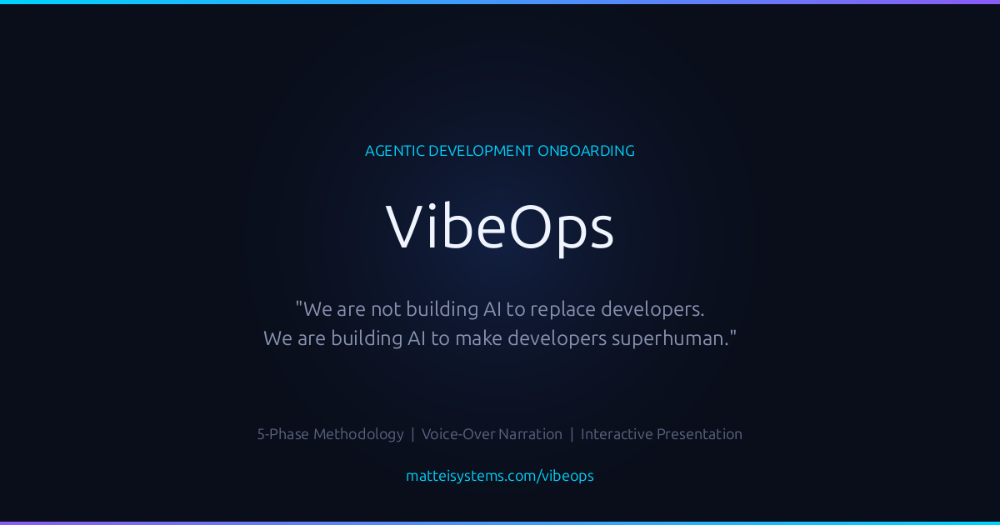

[](https://mariano215.github.io/agentic-development-onboarding/presentation/)

### [Watch the Presentation](https://mariano215.github.io/agentic-development-onboarding/presentation/) — 4 min narrated overview of the VibeOps methodology

---

# VibeOps: Agentic Development Onboarding System

**We are not building AI to replace developers. We are building AI to make developers superhuman.**

## What This Is

A comprehensive onboarding system that teaches **VibeOps** — the philosophy of human-AI collaborative software development. This system embodies verification-first development principles for an era when code is abundant and judgment is scarce.

## The Four Pillars of VibeOps

| Pillar | Principle |
|--------|-----------|
| **AI Partnership** over Tool Usage | Collaborate with AI agents as thinking partners, not autocomplete |
| **Verification** over Implementation | Prove before you build |
| **Orchestration** over Coding | Guide intelligent systems, don't write every line |
| **Emergence** over Planning | Create conditions for solutions to arise |

## The Bottleneck Has Shifted

In traditional development, the bottleneck was **coding speed** — how fast can I type, how fast can I implement?

In agentic development, the bottleneck is **human judgment** — how quickly can I verify what's right?

This changes everything about how we work.

## Quick Start

```bash
git clone https://github.com/Mariano215/agentic-development-onboarding.git
cd agentic-development-onboarding
./onboard.sh
```

Choose **"Start VibeOps Tutorial"** from the interactive menu. The system tracks your progress, enforces verification gates, and guides you through each phase at your own pace.

## The 5-Phase Journey

```
Phase 1: Philosophy Foundation ──→ 80% Assessment Gate
Phase 2: Frame the Problem     ──→ Acceptance Tests Gate
Phase 3: Model Security        ──→ Threat Model Gate
Phase 4: Generate with AI      ──→ Code Verification Gate
Phase 5: Verify & Observe      ──→ Production Readiness Gate
                                        │
                                   Graduation
```

### Phase 1: Philosophy Foundation
Read the Agentic Development Manifesto, study how traditional and agentic approaches differ, then pass an interactive assessment. **80% required to advance.** No progression without verified understanding.

### Phase 2: Frame the Problem
Define intent with executable acceptance criteria using GIVEN/WHEN/THEN format instead of vague requirements.

### Phase 3: Model Security & Threats
Apply the STRIDE framework to model threats **before** any code is generated. Security-first, not security-later.

### Phase 4: Generate with AI Partnership
Partner with AI to generate code within verified, secure boundaries. CLAUDE.md conventions, agentic workflows, and prompt engineering.

### Phase 5: Verify & Observe
Three verification layers:
- **Security** — Static analysis, secrets scanning, dependency audits
- **Quality** — Unit tests, integration tests, end-to-end coverage
- **Deployment** — Health checks, canary releases, rollback testing

*Shipping code is easy. Shipping verified code is the only part that matters.*

## The Toolkit

| Tool | Purpose |
|------|---------|
| `onboard.sh` | Master orchestrator for the learning journey |
| `setup-current-project.sh` | Integrate VibeOps into existing projects |
| `verification-gates/` | Security, quality, and deployment pipelines |
| `shared/progress-tracker.sh` | JSON-based progress tracking |
| `AGENTIC_DEVELOPMENT_MANIFESTO.md` | Core philosophy (essential reading) |

## AI-Agnostic, Claude Code Native

The VibeOps methodology works with **any AI coding tool** — Claude Code, Copilot, Cursor, or whatever comes next. The principles are universal.

This reference implementation is built natively on **Claude Code** with CLAUDE.md conventions, agentic workflows, and project setup scripts baked in.

## Contributing

### Contribute to the Manifesto

The **Agentic Development Manifesto** is a living document maintained in its own repo. We're actively seeking contributors:

**[github.com/Mariano215/agentic-development-manifesto](https://github.com/Mariano215/agentic-development-manifesto)**

We're looking for developers and engineering leaders who want to:

- **Shape the methodology** — propose principles, challenge assumptions, refine the pillars
- **Test against real projects** — validate the methodology in production environments
- **Share case studies** — document how agentic development works in your context

### Contribute to the Onboarding System

This repo implements the manifesto as a hands-on learning experience:

1. Frame first — clear problem definition before coding
2. Model threats — security analysis for all changes
3. Human judgment — thoughtful review of AI-generated code
4. All gates green — no merging without passing verification

## The Vision

The future of software development is not AI replacing developers. It's **human judgment amplified by AI**.

**Your judgment is the superpower. Welcome to VibeOps.**

---

**Version**: 1.0 | **Created**: February 2026 | **License**: MIT
